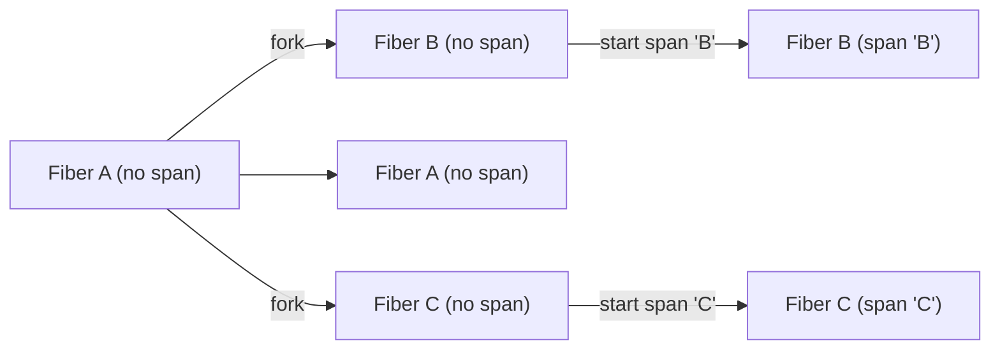

Context propagation is essential for distributed tracing. It enables spans to form parent-child relationships and allows trace information to flow through your application and across service boundaries.

## Overview

The tracing context propagation in otel4s is built on [cats.mtl.Local](https://typelevel.org/cats-mtl/mtl-classes/local.html) semantics:

```scala
trait Local[F[_], E] {
  def ask: F[E]
  def local[A](fa: F[A])(f: E => E): F[A]
}
```

This abstraction allows expressing and managing local modifications of the tracing context within effectful computations.

## How Context Flows

When you create spans, the context automatically propagates through your effect:



Key properties:
- Each fiber maintains its own context
- Forked fibers inherit the parent's context
- Context changes are local to the fiber

## Choosing a Context Carrier

Otel4s supports two primary context carriers. In most cases, **IOLocal** is the preferred and efficient choice.

### IOLocal (Recommended)

`IOLocal` provides efficient, fiber-local context storage built into Cats Effect:

<CodeGroup>
```scala Explicit Local
import cats.effect._
import cats.mtl.Local
import cats.syntax.flatMap._
import org.typelevel.otel4s.oteljava.context.Context
import org.typelevel.otel4s.oteljava.OtelJava
import io.opentelemetry.api.GlobalOpenTelemetry

def createOtel4s[F[_]: Async](implicit L: Local[F, Context]): F[OtelJava[F]] =
  Async[F].delay(GlobalOpenTelemetry.get).flatMap(OtelJava.fromJOpenTelemetry[F])

def program[F[_]: Async](otel4s: OtelJava[F]): F[Unit] = {
  val _ = otel4s
  Async[F].unit
}

val run: IO[Unit] =
  IOLocal(Context.root).map(_.asLocal).flatMap { implicit local: Local[IO, Context] =>
    createOtel4s[IO].flatMap(otel4s => program(otel4s))
  }
```

```scala Shortcut
import cats.effect._
import cats.syntax.flatMap._
import org.typelevel.otel4s.oteljava.OtelJava
import io.opentelemetry.api.GlobalOpenTelemetry

def createOtel4s[F[_]: Async: LiftIO]: F[OtelJava[F]] =
  Async[F].delay(GlobalOpenTelemetry.get).flatMap(OtelJava.fromJOpenTelemetry[F])

def program[F[_]: Async](otel4s: OtelJava[F]): F[Unit] = {
  val _ = otel4s
  Async[F].unit
}

val run: IO[Unit] =
  createOtel4s[IO].flatMap(otel4s => program(otel4s))
```

```scala Global Instance
import cats.effect._
import org.typelevel.otel4s.oteljava.OtelJava

def program[F[_]: Async](otel4s: OtelJava[F]): F[Unit] = {
  val _ = otel4s
  Async[F].unit
}

val run: IO[Unit] =
  OtelJava.global[IO].flatMap(otel4s => program(otel4s))
```
</CodeGroup>

### Kleisli

`Kleisli` provides context through function composition:

```scala
import cats.effect._
import cats.syntax.flatMap._
import cats.data.Kleisli
import cats.mtl.Local
import org.typelevel.otel4s.oteljava.context.Context
import org.typelevel.otel4s.oteljava.OtelJava
import io.opentelemetry.api.GlobalOpenTelemetry

def createOtel4s[F[_]: Async](implicit L: Local[F, Context]): F[OtelJava[F]] =
  Async[F].delay(GlobalOpenTelemetry.get).flatMap(OtelJava.fromJOpenTelemetry[F])

def program[F[_]: Async](otel4s: OtelJava[F]): F[Unit] = {
  val _ = otel4s
  Async[F].unit
}

val kleisli: Kleisli[IO, Context, Unit] =
  createOtel4s[Kleisli[IO, Context, *]].flatMap(otel4s => program(otel4s))

val run: IO[Unit] = kleisli.run(Context.root)
```

## Context Operations

### Accessing Current Context

Retrieve the current span context:

```scala
import org.typelevel.otel4s.trace.Tracer

def example[F[_]: Tracer]: F[Unit] = {
  for {
    maybeContext <- Tracer[F].currentSpanContext
    _ <- maybeContext match {
      case Some(ctx) => processWithContext(ctx)
      case None => processWithoutContext()
    }
  } yield ()
}
```

### Creating Child Contexts

Explicitly create a child span with a specific parent:

```scala
val customParent: SpanContext = ???

Tracer[F].childScope(customParent) {
  Tracer[F].span("child-operation").use { span =>
    // This span is a child of customParent
    ???
  }
}
```

### Joining External Contexts

Extract and join context from carriers (e.g., HTTP headers):

```scala
val headers: Map[String, String] = Map(
  "traceparent" -> "00-80f198ee56343ba864fe8b2a57d3eff7-e457b5a2e4d86bd1-01"
)

Tracer[F].joinOrRoot(headers) {
  Tracer[F].span("downstream-operation").use { span =>
    // This span is a child of the extracted parent
    ???
  }
}
```

### Creating Root Contexts

Start a new trace without a parent:

```scala
Tracer[F].rootScope {
  Tracer[F].span("independent-operation").use { span =>
    // This span starts a new trace
    ???
  }
}
```

### Disabling Context

Run operations without tracing:

```scala
Tracer[F].noopScope {
  Tracer[F].span("not-traced").use { _ =>
    // This span is not created
    ???
  }
}
```

## Propagating Context Across Boundaries

### HTTP Requests

Inject context into outgoing HTTP requests:

```scala
import org.typelevel.otel4s.trace.Tracer
import org.http4s.client.Client
import org.http4s.{Request, Uri}

def makeRequest[F[_]: Async: Tracer](
    client: Client[F],
    uri: Uri
): F[String] = {
  for {
    // Inject trace context into headers
    headers <- Tracer[F].propagate(Map.empty[String, String])

    // Create request with propagated headers
    request = Request[F](uri = uri)
      .withHeaders(headers.toSeq.map { case (k, v) =>
        org.http4s.Header.Raw(org.http4s.ci.CIString(k), v)
      }: _*)

    // Execute request
    response <- client.expect[String](request)
  } yield response
}
```

Extract context from incoming HTTP requests:

```scala
import org.http4s.HttpRoutes
import org.http4s.dsl.Http4sDsl

def routes[F[_]: Async: Tracer]: HttpRoutes[F] = {
  val dsl = new Http4sDsl[F]{}
  import dsl._

  HttpRoutes.of[F] {
    case req @ GET -> Root / "endpoint" =>
      // Extract headers as Map
      val headers = req.headers.headers.map(h => h.name.toString -> h.value).toMap

      // Join trace context from headers
      Tracer[F].joinOrRoot(headers) {
        Tracer[F].span("handle-endpoint").use { _ =>
          Ok("Response")
        }
      }
  }
}
```

### Message Queues

Propagate context through message attributes:

```scala
case class Message(id: String, body: String, attributes: Map[String, String])

def publishMessage[F[_]: Async: Tracer](msg: Message): F[Unit] = {
  for {
    // Inject trace context into message attributes
    enrichedAttrs <- Tracer[F].propagate(msg.attributes)
    enrichedMsg = msg.copy(attributes = enrichedAttrs)

    // Publish message
    _ <- sendToQueue(enrichedMsg)
  } yield ()
}

def consumeMessage[F[_]: Async: Tracer](msg: Message): F[Unit] = {
  // Extract and join context from message attributes
  Tracer[F].joinOrRoot(msg.attributes) {
    Tracer[F].span("process-message").use { _ =>
      processMessageBody(msg.body)
    }
  }
}
```

## Resource Limitations

The current encoding of `cats.effect.Resource` is incompatible with `Local` semantics. This affects tracing across resource lifecycle stages.

### The Problem

 You cannot automatically trace all resource stages (acquire, use, release) while staying within the resource scope:

```scala
// This structure is NOT possible without explicit tracing
val traced: Resource[F, Connection[F]] = ???
// Desired but unachievable:
// > resource
//   > acquire
//   > use
//     > inner spans
//   > release
```

### The Solution

Explicitly trace each stage:

```scala
import org.typelevel.otel4s.trace.Tracer
import cats.effect.{Async, Resource}

class Connection[F[_]]

def acquire[F[_]: Async]: F[Connection[F]] = ???
def release[F[_]: Async](c: Connection[F]): F[Unit] = ???

val resource: Resource[F, Connection[F]] =
  Resource.make(
    Tracer[F].span("acquire-connection").surround(acquire)
  ) { connection =>
    Tracer[F].span("release").surround(release(connection))
  }

def useConnection[F[_]: Async](c: Connection[F]): F[Unit] = ???

val io: F[Unit] = Tracer[F].span("resource").surround(
  resource.use { connection =>
    Tracer[F].span("use").surround(useConnection(connection))
  }
)
```

For advanced resource tracing patterns, see the [Tracing documentation](/concepts/tracing#working-with-resources).

## Semantic Conventions

When propagating context, use standard propagators configured via environment variables:

```bash
# W3C Trace Context (default)
export OTEL_PROPAGATORS=tracecontext,baggage

# B3 (Zipkin)
export OTEL_PROPAGATORS=b3multi

# Multiple propagators
export OTEL_PROPAGATORS=tracecontext,b3multi,baggage
```

See the [OpenTelemetry SDK configuration guide](https://opentelemetry.io/docs/reference/specification/sdk-environment-variables/#general-sdk-configuration) for all options.

## Best Practices

1. **Use IOLocal** for most applications - it's efficient and well-integrated with Cats Effect

2. **Propagate context at boundaries** - Always inject and extract context when crossing service boundaries

3. **Use standard propagators** - Stick to W3C Trace Context unless you have specific requirements

4. **Handle missing context gracefully** - Use `joinOrRoot` to start a new trace if context extraction fails

5. **Be explicit with resources** - Manually wrap resource stages with spans for proper tracing

6. **Minimize context switching** - Avoid unnecessary `rootScope` or `childScope` calls

7. **Test context propagation** - Verify that trace IDs flow correctly through your system

## Common Patterns

### Combining Context Operations

```scala
def complexOperation[F[_]: Async: Tracer]: F[Unit] = {
  // Start with external context if available
  Tracer[F].joinOrRoot(incomingHeaders) {
    Tracer[F].span("main-operation").use { mainSpan =>
      for {
        // Create parallel operations with shared parent
        _ <- Tracer[F].childScope(mainSpan.context) {
          operation1().parProduct(operation2())
        }

        // Create independent background task
        _ <- Tracer[F].rootScope {
          backgroundTask().start
        }

        // Propagate to downstream service
        headers <- Tracer[F].propagate(Map.empty[String, String])
        _ <- callDownstream(headers)
      } yield ()
    }
  }
}
```

### Context-Aware Logging

```scala
import org.typelevel.otel4s.trace.Tracer

def logWithContext[F[_]: Async: Tracer](message: String): F[Unit] = {
  Tracer[F].currentSpanContext.flatMap {
    case Some(ctx) =>
      logger.info(s"[trace_id=${ctx.traceId.toHex}] $message")
    case None =>
      logger.info(message)
  }
}
```

## Type Signatures

```scala
// cats.mtl.Local
trait Local[F[_], E] {
  def ask: F[E]
  def local[A](fa: F[A])(f: E => E): F[A]
}

// Context operations in Tracer
trait Tracer[F[_]] {
  def currentSpanContext: F[Option[SpanContext]]
  def childScope[A](parent: SpanContext)(fa: F[A]): F[A]
  def rootScope[A](fa: F[A]): F[A]
  def noopScope[A](fa: F[A]): F[A]
  def joinOrRoot[A, C: TextMapGetter](carrier: C)(fa: F[A]): F[A]
  def propagate[C: TextMapUpdater](carrier: C): F[C]
}
```
