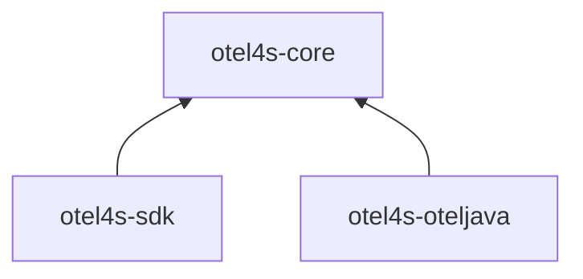
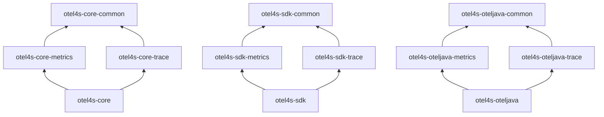

# Module structure

otel4s is designed with modularity in mind. The project is organized into distinct high-level modules, each serving specific purposes and functionalities. These modules are: `otel4s-core`, `otel4s-sdk`, and `otel4s-oteljava`.

The primary motivation behind this modular architecture is to keep the classpath small.

## High-level modules



### 1. otel4s-core

Defines the interfaces: [Tracer](/api/tracer), [Meter](/api/meter), and others. It also offers no-op implementations.

**Use this module when:**
- You're developing a library and want to add telemetry instrumentation
- You want minimal dependencies and the smallest classpath
- You want users to choose their own backend implementation

### 2. otel4s-sdk

The implementation of the OpenTelemetry specification written purely in Scala. Available for all platforms: JVM, Scala Native, and Scala.js.

**Use this module when:**
- You need cross-platform support (Scala.js or Scala Native)
- You prefer a pure Scala implementation
- You're willing to accept some experimental features

<Warning>
The SDK backend remains **experimental** and some functionality may be lacking. Memory overhead may be noticeable compared to the Java SDK backend.
</Warning>

### 3. otel4s-oteljava

The implementation of `otel4s-core` interfaces using [OpenTelemetry Java](https://github.com/open-telemetry/opentelemetry-java) under the hood.

**Use this module when:**
- You're developing a JVM application and want to export telemetry
- You want production-ready, well-tested telemetry
- You want access to the extensive Java instrumentation ecosystem
- You need low memory overhead

## High-level module structure

Each high-level module has several submodules:

1. `{x}-common` - Shared code used by `{x}-trace` and `{x}-metrics`
2. `{x}-trace` - Tracing-specific code
3. `{x}-metrics` - Metrics-specific code
4. `{x}` - The high-level module itself, aggregating all of the above

The current structure of the modules:



## Which module do I need?

Let's look at common scenarios:

<Accordion title="I'm developing a library and only need tracing">
  **Use `otel4s-core-trace`**

  ```scala build.sbt
  libraryDependencies += "org.typelevel" %% "otel4s-core-trace" % "0.15.0"
  ```

  This gives you access to the `Tracer` interface with minimal dependencies.
</Accordion>

<Accordion title="I'm developing a library and need both tracing and metrics">
  **Use `otel4s-core`**

  ```scala build.sbt
  libraryDependencies += "org.typelevel" %% "otel4s-core" % "0.15.0"
  ```

  This includes both `Tracer` and `Meter` interfaces.
</Accordion>

<Accordion title="I'm developing an application and want to export telemetry">
  **Use `otel4s-oteljava`** (recommended)

  ```scala build.sbt
  libraryDependencies ++= Seq(
    "org.typelevel" %% "otel4s-oteljava" % "0.15.0",
    "io.opentelemetry" % "opentelemetry-exporter-otlp" % "1.59.0" % Runtime,
    "io.opentelemetry" % "opentelemetry-sdk-extension-autoconfigure" % "1.59.0" % Runtime
  )
  ```

  This gives you a production-ready backend with low overhead and extensive integrations.
</Accordion>

<Accordion title="I need Scala.js or Scala Native support">
  **Use `otel4s-sdk`**

  ```scala build.sbt
  libraryDependencies += "org.typelevel" %% "otel4s-sdk" % "0.15.0"
  ```

  <Warning>
  The SDK backend is experimental. Some features may be missing or have higher memory overhead.
  </Warning>
</Accordion>

## Module comparison

| Feature | otel4s-core | otel4s-sdk | otel4s-oteljava |
|---------|-------------|------------|------------------|
| **Purpose** | Interfaces only | Pure Scala impl | Java SDK wrapper |
| **JVM** | ✅ | ✅ | ✅ |
| **Scala.js** | ✅ | ✅ | ❌ |
| **Scala Native** | ✅ | ✅ | ❌ |
| **Production ready** | N/A | ⚠️ Experimental | ✅ |
| **Memory overhead** | Minimal | Higher | Low |
| **Dependencies** | Minimal | Medium | Many |
| **Use case** | Libraries | Cross-platform apps | JVM applications |

## Next steps

<CardGroup cols={2}>
  <Card title="Quickstart" icon="rocket" href="/quickstart">
    Get started with otel4s in your application
  </Card>
  <Card title="OTel Java backend" icon="java" href="/backends/oteljava/overview">
    Learn about the recommended backend for JVM applications
  </Card>
  <Card title="SDK backend" icon="code" href="/backends/sdk/overview">
    Explore the pure Scala implementation
  </Card>
  <Card title="Core concepts" icon="book" href="/concepts/tracing">
    Understand tracing, metrics, and context propagation
  </Card>
</CardGroup>